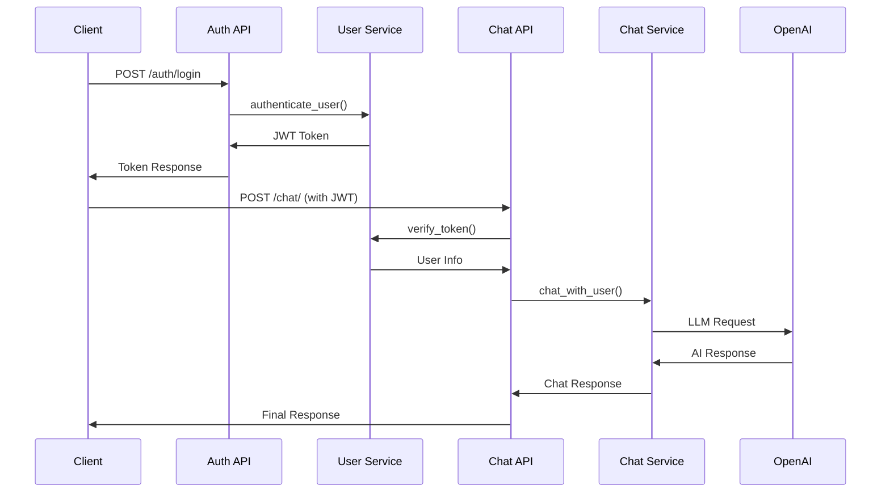

# Escape Room AI Chatbot

AI 기반 방탈출 추천 챗봇 서비스입니다.

## 🚀 주요 기능

- **사용자 인증**: JWT + Redis 이중 검증
- **선호도 파악**: 단계별 질문을 통한 사용자 프로필 생성
- **AI 챗봇**: OpenAI GPT 기반 자연어 대화
- **방탈출 추천**: 하이브리드 검색 (필터 + 벡터 유사도)
- **세션 관리**: Redis 캐시 + PostgreSQL 백업

## 🏗️ 시스템 구조

```
app/
├── api/           # FastAPI 엔드포인트
│   ├── auth.py    # 인증 (회원가입, 로그인)
│   └── chat.py    # 챗봇 대화
├── services/      # 비즈니스 로직
│   ├── chat_service.py      # 챗봇 핵심 로직
│   ├── user_service.py      # 사용자 관리
│   ├── nlp_service.py       # 의도 분석
│   └── recommendation_service.py  # 추천 시스템
├── repositories/  # 데이터 접근
├── models/        # Pydantic 모델
└── utils/         # 유틸리티 (인증, 지역별(한국) 시간)
```

## 🔄 핵심 플로우

### **1. 사용자 인증**
1. 회원가입/로그인 → JWT 토큰 발급
2. 토큰을 Redis에 저장 (이중 검증)
3. API 요청 시 토큰 검증

### **2. 챗봇 대화**
1. **선호도 파악**: 신규 사용자 → 단계별 질문
2. **일반 대화**: 기존 사용자 → 방탈출 추천
3. **의도 분석**: LLM 기반 사용자 의도 파악
4. **추천 생성**: 하이브리드 검색 (필터 + 벡터)

## 🛠️ 기술 스택

- **Backend**: FastAPI, Python 3.13
- **Database**: PostgreSQL + pgvector (벡터 검색)
- **Cache**: Redis (세션 관리)
- **AI**: OpenAI GPT, LangChain
- **Authentication**: JWT + bcrypt

## 📋 API 엔드포인트

### **인증**
- `POST /auth/register` - 회원가입
- `POST /auth/login` - 로그인
- `GET /auth/me` - 현재 사용자 정보

### **채팅**
- `POST /chat/` - 챗봇과 대화
- `GET /health` - 헬스체크

## 🔄 API 동작 흐름



<!-- ## 🚀 빠른 시작
- [API docs]() 로 접속해서 테스트 할 수 있습니다. 
- 또는 부하테스트를 원하시면 [부하테스트 링크]()로 접속하세요. -->
