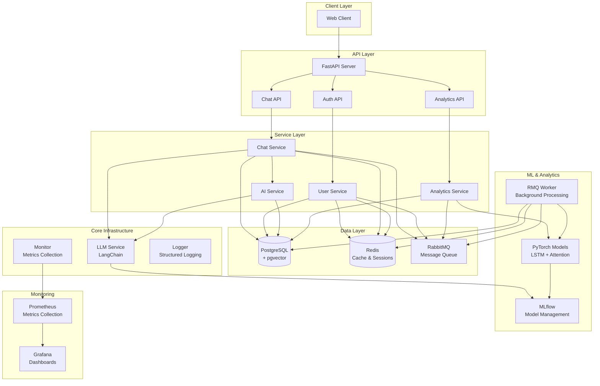
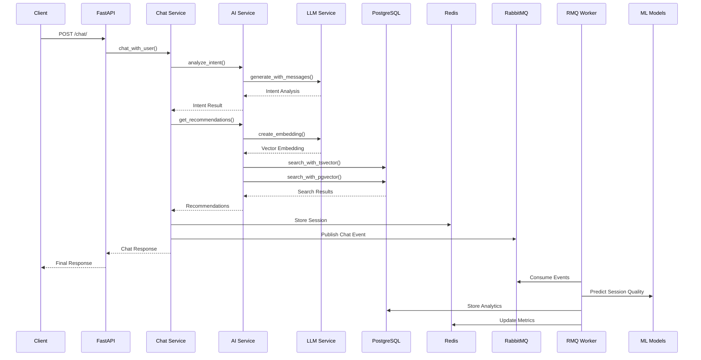

# Escape Room AI Platform

**AI 기반 방탈출 추천 플랫폼**으로, LangChain 기반 LLM 서비스와 PyTorch ML 모델을 활용한 개인화 추천 시스템입니다.

## 🎯 서비스 개요

### **핵심 기술 특성**

- **확장 가능한 LLM 아키텍처**: LangChain 기반으로 OpenAI, Anthropic, Google 등 다양한 LLM 제공자 지원
- **RAG 하이브리드 검색**: tsvector(키워드) + pgvector(의미) 검색으로 정확한 방탈출 추천
- **실시간 ML 추론**: PyTorch LSTM + Attention 모델로 세션 품질 예측 및 개인화 추천
- **비동기 데이터 처리**: RabbitMQ 기반 사용자 행동 분석 및 실시간 메트릭 수집

## 🚀 주요 기능

### **AI 챗봇 & 추천 시스템**

- **NLP 파이프라인**: LLM 기반 의도 분석(Intent Analysis)과 엔티티 추출(Entity Extraction)을 통한 자연어 이해
- **의도 분석**: 사용자 메시지의 의도 자동 분류 (room_recommendation, room_inquiry, general_chat)
- **엔티티 추출**: 대화에서 선호도 정보 자동 추출 (지역, 테마, 인원수, 난이도 등)
- **RAG 하이브리드 검색**: tsvector(키워드) + pgvector(의미) 검색으로 개인 선호도에 맞는 방탈출 추천
- **자연어 대화**: OpenAI GPT 기반 지능형 챗봇 (LangChain 표준)

### **ML 기반 분석 & 예측**

- **개인화 추천**: PyTorch 신경망 모델 기반 사용자 맞춤형 추천
- **트렌드 예측**: LSTM 모델을 통한 월별 인기 테마/지역 예측
- **세션 품질 예측**: LSTM + Attention 모델로 세션 품질 실시간 평가
- **비즈니스 인사이트**: 인기 지역/테마, 사용자 트렌드 분석

### **인프라 & 모니터링**

- **세션 관리**: Redis 캐시 + PostgreSQL 백업
- **비동기 처리**: RabbitMQ 기반 사용자 행동 분석 및 메트릭 수집
- **실시간 모니터링**: Prometheus + Grafana 대시보드
- **ML 모델 관리**: MLflow를 통한 모델 관리 및 실험 추적

## 🧠 기술 스택

### **AI/ML**

- **LangChain**: 확장 가능한 LLM 서비스 아키텍처
- **OpenAI GPT-4o-mini**: 메인 LLM (비용 효율성)
- **NLP**: 의도 분석, 엔티티 추출, 자연어 이해
- **PyTorch**: LSTM + Attention 모델 구현
- **MLflow**: 모델 관리 및 실험 추적
- **RAG**: tsvector(키워드) + pgvector(의미) 하이브리드 검색

### **Backend & Database**

- **FastAPI**: Python 3.13 웹 프레임워크
- **PostgreSQL + pgvector**: 벡터 검색 지원 데이터베이스
- **Redis**: 세션 관리 및 캐싱
- **RabbitMQ**: 비동기 메시지 큐

### **모니터링 & 인프라**

- **Prometheus + Grafana**: 메트릭 수집 및 대시보드
- **Docker Compose**: 컨테이너 오케스트레이션
- **구조화된 로깅**: JSON 형식 로그 수집

## 📊 모니터링 & 메트릭

### **수집 메트릭**

- **비즈니스**: 채팅 수, RAG 사용률, 추천 성공률, 사용자 활성도
- **성능**: 응답 시간, DB 쿼리 시간, 시스템 리소스 사용량
- **비용**: OpenAI API 비용, 인프라 비용, 처리량당 비용
- **에러**: 에러율, 에러 타입별 분류, 재시도 패턴

### **수집 방식**

- **자동 수집**: 데코레이터 기반 메트릭 수집
- **실시간 저장**: JSONL 형식으로 일별 파일 저장
- **대시보드**: Prometheus + Grafana를 통한 실시간 모니터링

## 🏗️ 시스템 구조

```
escape-room-with-ai/
├── app/                   # 메인 애플리케이션
│   ├── api/              # FastAPI 엔드포인트
│   │   ├── auth.py       # 인증 (회원가입, 로그인)
│   │   ├── chat.py       # 챗봇 대화
│   │   └── analytics.py  # 비즈니스 분석 API
│   ├── core/             # 핵심 인프라 (공통 서비스)
│   │   ├── config.py     # 설정 관리
│   │   ├── connections.py # DB/Redis/RMQ 연결 관리
│   │   ├── exceptions.py # 커스텀 예외 정의
│   │   ├── logger.py     # 중앙화된 로깅
│   │   ├── llm.py        # LLM 서비스 (확장 가능한 LangChain 기반)
│   │   ├── monitor.py    # 종합 메트릭 수집 시스템
│   │   ├── postgres_manager.py # PostgreSQL 관리
│   │   ├── redis_manager.py    # Redis 관리
│   │   └── rmq_manager.py      # RabbitMQ 관리
│   ├── services/         # 비즈니스 로직
│   │   ├── chat_service.py     # 챗봇 핵심 로직
│   │   ├── user_service.py     # 사용자 관리
│   │   ├── ai_service.py       # AI 서비스 (NLP + RAG)
│   │   └── analytics_service.py # 사용자 행동 분석 (PyTorch ML 모델)
│   ├── repositories/     # 데이터 접근
│   │   ├── chat_repository.py      # 채팅 세션 관리
│   │   ├── escape_room_repository.py # 방탈출 데이터
│   │   ├── user_repository.py      # 사용자 데이터
│   │   └── analytics_repository.py # 분석 데이터
│   ├── models/           # Pydantic 모델
│   │   ├── user.py       # 사용자 모델
│   │   ├── escape_room.py # 방탈출 모델
│   │   └── analytics.py  # 분석 모델
│   ├── utils/            # 유틸리티 (인증, 시간 관리)
│   └── workers/          # 백그라운드 워커
│       └── rmq_worker.py # RabbitMQ 메시지 처리
├── data/                 # 메트릭 데이터
│   └── metrics/          # 일별 메트릭 파일
├── logs/                 # 애플리케이션 로그
├── grafana/              # Grafana 대시보드
├── prometheus/           # Prometheus 설정
├── requirements.txt      # Python 패키지 의존성
├── pyproject.toml        # isort + black 설정
├── docker-compose.yml    # Docker Compose 설정
└── README.md            # 프로젝트 문서
```

## 🔄 핵심 플로우

### **1. 사용자 인증**

회원가입/로그인 → JWT 토큰 발급 → Redis 저장 → API 요청 시 토큰 검증

### **2. 챗봇 대화**

1. **의도 분석**: LLM 기반 사용자 메시지 의도 파악 (room_recommendation, room_inquiry, general_chat)
2. **엔티티 추출**: 대화에서 선호도 정보 자동 추출 (지역, 테마, 인원수, 난이도 등)
3. **응답 생성**: 의도에 따른 맞춤형 응답 (추천, 정보 제공, 일반 대화)
4. **추천 생성**: RAG 하이브리드 검색 (tsvector + pgvector)

### **3. 데이터 처리**

- **중요한 이벤트**: 등록, 로그인, 에러 → 즉시 RMQ 전송
- **일반 이벤트**: 채팅, 추천 → 배치 처리 (5분마다)
- **RMQ Worker**: 배치 이벤트들을 그룹화하여 효율적 처리

## 📋 API 엔드포인트

- `POST /auth/register` - 회원가입
- `POST /auth/login` - 로그인
- `POST /chat/` - 챗봇과 대화
- `GET /analytics/insights` - 비즈니스 인사이트 조회
- `GET /analytics/personalized/{user_id}` - 개인화 추천 생성
- `GET /analytics/trends/monthly` - 월별 트렌드 예측
- `GET /analytics/session-quality/{user_id}/{session_id}` - 세션 품질 예측

## 🎯 기술적 특징 & 설계 의도

### **확장성과 유연성**

- **LangChain 기반 LLM 아키텍처**: 다양한 LLM 제공자(OpenAI, Anthropic, Google) 지원으로 벤더 락인 방지
- **계층형 아키텍처**: API → Service → Repository 분리로 유지보수성과 테스트 용이성 확보
- **비동기 처리**: RabbitMQ 기반 메시지 큐로 확장 가능한 백그라운드 처리

### **정확한 추천을 위한 하이브리드 검색**

- **tsvector + pgvector 결합**: 키워드 검색의 정확성과 의미 검색의 폭넓음을 동시에 확보
- **가중치 기반 랭킹**: tsvector(0.7) + pgvector(0.3)로 검색 결과 최적화
- **실시간 임베딩**: 사용자 메시지를 실시간으로 벡터화하여 의미적 유사도 검색

### **데이터 기반 의사결정**

- **실시간 메트릭 수집**: 사용자 행동, 성능, 비용 데이터를 자동으로 수집하고 분석
- **ML 기반 예측**: PyTorch LSTM + Attention 모델로 세션 품질과 트렌드 예측
- **비즈니스 인사이트**: 인기 지역/테마 분석으로 서비스 개선점 도출

### **운영 효율성**

- **자동화된 모니터링**: Prometheus + Grafana로 시스템 상태 실시간 추적
- **구조화된 로깅**: JSON 형식 로그로 디버깅과 분석 용이성 확보
- **배치 처리 최적화**: 중요한 이벤트는 즉시, 일반 이벤트는 배치로 처리하여 성능과 비용 최적화

## 🔄 시스템 아키텍처



## 🔄 데이터 플로우



---

**AI/ML 기술을 활용한 방탈출 추천 플랫폼으로, LangChain 기반 LLM 서비스와 PyTorch 신경망 모델을 통해 사용자의 개인 선호도에 맞는 맞춤형 추천 서비스를 제공합니다.**
