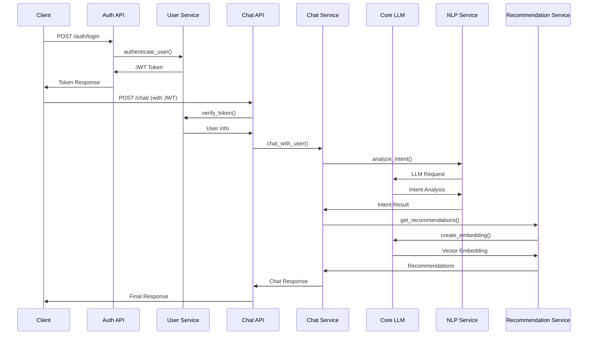
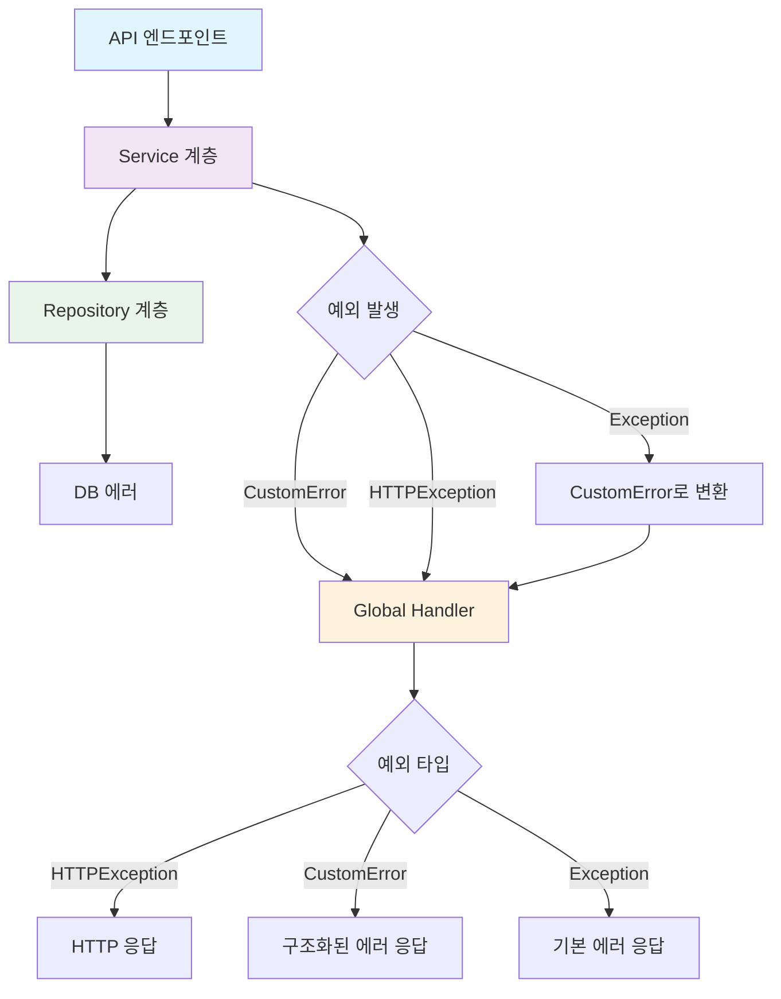

# Escape Room AI Chatbot

AI 기반 방탈출 추천 챗봇 서비스입니다.

## 🚀 주요 기능

- **사용자 인증**: JWT + Redis 이중 검증
- **선호도 파악**: 단계별 질문을 통한 사용자 프로필 생성
- **AI 챗봇**: OpenAI GPT 기반 자연어 대화
- **방탈출 추천**: 하이브리드 검색 (필터 + 벡터 유사도)
- **세션 관리**: Redis 캐시 + PostgreSQL 백업

## 🏗️ 시스템 구조

```
app/
├── api/           # FastAPI 엔드포인트
│   ├── auth.py    # 인증 (회원가입, 로그인)
│   └── chat.py    # 챗봇 대화
├── core/          # 핵심 인프라 (공통 서비스)
│   ├── config.py      # 설정 관리
│   ├── connections.py  # DB/Redis 연결 관리
│   ├── exceptions.py   # 커스텀 예외 정의
│   ├── logger.py       # 중앙화된 로깅
│   ├── llm.py          # LLM 서비스 (OpenAI)
│   ├── postgres_manager.py  # PostgreSQL 관리
│   └── redis_manager.py     # Redis 관리 (캐시, Rate Limiting)
├── services/      # 비즈니스 로직
│   ├── chat_service.py      # 챗봇 핵심 로직
│   ├── user_service.py      # 사용자 관리
│   ├── nlp_service.py       # 의도 분석
│   └── recommendation_service.py  # 추천 시스템
├── repositories/  # 데이터 접근
│   ├── chat_repository.py      # 채팅 세션 관리
│   ├── escape_room_repository.py  # 방탈출 데이터
│   └── user_repository.py      # 사용자 데이터
├── models/        # Pydantic 모델
└── utils/         # 유틸리티 (인증, 시간 관리)
```

## 🔄 핵심 플로우

### **1. 사용자 인증**
1. 회원가입/로그인 → JWT 토큰 발급
2. 토큰을 Redis에 저장 (이중 검증)
3. API 요청 시 토큰 검증

### **2. 챗봇 대화**
1. **선호도 파악**: 신규 사용자 → 단계별 질문
2. **일반 대화**: 기존 사용자 → 방탈출 추천
3. **의도 분석**: LLM 기반 사용자 의도 파악
4. **추천 생성**: 하이브리드 검색 (필터 + 벡터)

## 🛠️ 기술 스택

- **Backend**: FastAPI, Python 3.13
- **Database**: PostgreSQL + pgvector (벡터 검색)
- **Cache**: Redis (세션 관리, Rate Limiting, 캐싱)
- **AI**: OpenAI GPT-3.5-turbo, LangChain, OpenAI Embeddings
- **Authentication**: JWT + bcrypt
- **Architecture**: 계층형 아키텍처 (API → Service → Repository)

## 📋 API 엔드포인트

### **인증**
- `POST /auth/register` - 회원가입
- `POST /auth/login` - 로그인
- `GET /auth/me` - 현재 사용자 정보

### **채팅**
- `POST /chat/` - 챗봇과 대화
- `GET /health` - 헬스체크

## 🔄 API 동작 흐름



## 🧠 LLM 아키텍처

### **Core 계층의 LLM 서비스**

LLM 서비스는 `app/core/llm.py`에 위치하여 순환 참조를 방지하고 공통 기능을 제공합니다.

#### **주요 특징**
- **중앙화된 LLM 관리**: 모든 AI 기능을 하나의 서비스에서 관리
- **순환 참조 해결**: Service 계층 간의 의존성 문제 해결
- **Singleton 패턴**: 메모리 효율적인 LLM 인스턴스 관리
- **임베딩 서비스**: 벡터 검색을 위한 텍스트 임베딩 생성

#### **LLM 서비스 구조**
```python
# app/core/llm.py
class LLM:
    def __init__(self):
        self.llm = ChatOpenAI(model="gpt-3.5-turbo")
        self.embeddings = OpenAIEmbeddings()
    
    async def generate_response(self, ...) -> str:
        # 챗봇 응답 생성
    
    async def create_embedding(self, text: str) -> list:
        # 벡터 임베딩 생성
```

#### **사용 패턴**
```python
# Service 계층에서 사용
from ..core.llm import llm

# NLP 분석
intent_result = await llm.analyze_intent(user_message)

# 추천 시스템
embedding = await llm.create_embedding(user_message)
```

### **LLM 활용 영역**

1. **의도 분석** (`nlp_service.py`): 사용자 메시지의 의도 파악
2. **선호도 분석**: 자연어 답변을 구조화된 데이터로 변환
3. **응답 생성**: 사용자 맞춤형 챗봇 응답 생성
4. **벡터 검색**: 방탈출 추천을 위한 임베딩 생성

## 🛡️ 예외 처리 구조

### **계층별 예외 처리 역할**

| 계층 | 역할 | 예외 처리 방식 |
|------|------|----------------|
| **API 계층** | 진입점만 제공 | 비즈니스 로직을 Service로 위임 |
| **Service 계층** | 비즈니스 로직 + 예외 처리 | CustomError/HTTPException 전파, Exception → CustomError 변환 |
| **Repository 계층** | DB 접근만 | DB 에러를 상위로 전파 |
| **Global Handler** | 최종 예외 처리 | 모든 예외를 HTTP 응답으로 변환 |

### **예외 처리 흐름**



### **예외 타입별 처리**

#### **1. CustomError (애플리케이션 커스텀 예외)**
```python
# Service 계층에서 발생
raise CustomError("VALIDATION_ERROR", "메시지를 입력해주세요.")

# Global Handler에서 처리
# → HTTP 422, {"status": "fail", "error_code": "200003", "message": "메시지를 입력해주세요."}
```

#### **2. HTTPException (FastAPI 기본 예외)**
```python
# Service 계층에서 발생
raise HTTPException(status_code=401, detail="인증이 필요합니다.")

# Global Handler에서 처리
# → HTTP 401, "인증이 필요합니다."
```

#### **3. Exception (예상치 못한 에러)**
```python
# Service 계층에서 발생
try:
    # 비즈니스 로직
    pass
except Exception as e:
    # CustomError로 변환
    raise CustomError("CHATBOT_ERROR", "챗봇 처리 중 오류가 발생했습니다.")

# Global Handler에서 처리
# → HTTP 500, {"status": "fail", "error_code": "202001", "message": "챗봇 처리 중 오류가 발생했습니다."}
```

### **에러 코드 체계**

| 에러 코드 | 카테고리 | 설명 |
|-----------|----------|------|
| **200xxx** | 공통 에러 | 시스템 전반적인 에러 |
| **201xxx** | 인증 에러 | 사용자 인증 관련 에러 |
| **202xxx** | 채팅 에러 | 챗봇 처리 관련 에러 |
| **203xxx** | 방탈출 에러 | 방탈출 데이터 관련 에러 |
| **204xxx** | Rate Limiting | 요청 제한 관련 에러 |

### **예외 처리 장점**

- **명확한 역할 분리**: 각 계층의 예외 처리 역할이 명확
- **일관된 에러 응답**: 모든 에러가 적절한 형태로 응답
- **중앙화된 처리**: Global Handler에서 모든 예외를 최종 처리
- **유연성**: CustomError와 HTTPException 모두 지원
- **안전성**: 예상치 못한 에러도 적절히 처리

<!-- ## 🚀 빠른 시작
- [API docs]() 로 접속해서 테스트 할 수 있습니다. 
- 또는 부하테스트를 원하시면 [부하테스트 링크]()로 접속하세요. -->
